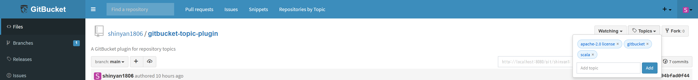
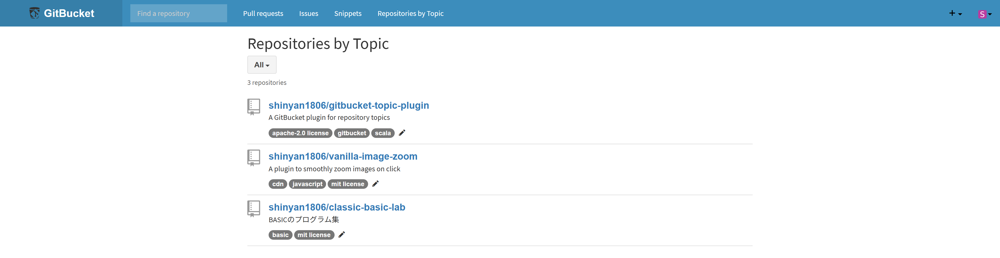

# gitbucket-topic-plugin
<div align="center">
  <a href="https://opensource.org/licenses/Apache-2.0">
    
  </a>
</div>
A GitBucket plugin for repository topics

[日本語版READMEはこちら](README.ja.md)

## Overview
This is a plugin for GitBucket that allows you to set topics for repositories, making classification and search easier. It adds a topic dropdown to the repository top page and provides a list page to search repositories by topic.

## ScreenShot


You can add or edit topics from the dropdown on the repository top page.


You can list repositories and search for repositories associated with topics. You can also add or edit topics from this page.

## Compatibility
Plugin version|GitBucket version
:---|:---
1.0.x|4.46.x -

## Contributing
Bug reports and feature suggestions are welcome.

## Development
This plugin is based on [gitbucket/gitbucket-plugin-template](https://github.com/gitbucket/gitbucket-plugin-template).

### Requirements
- Java 17
- sbt

### Development Commands
```bash
# Static analysis & fix
sbt codeCheck
# Build
sbt assembly
```
The generated jar file will be output to `target/scala-2.13`.

## License
Released under the Apache License 2.0.  
**[LICENSE](LICENSE)**
